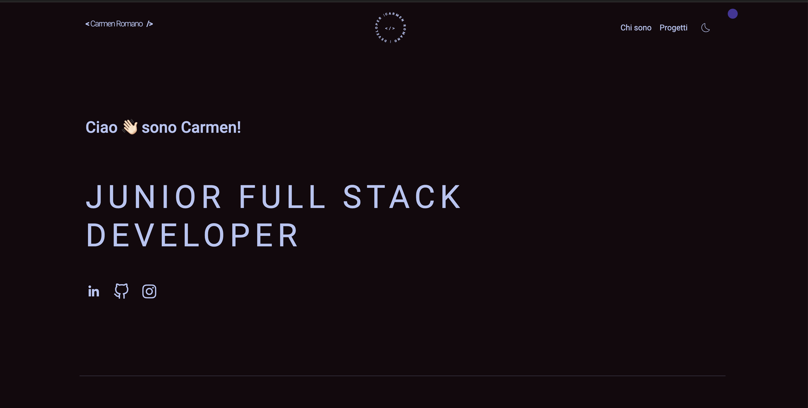

<h2 align="center">
  Portfolio Website - Carmen Romano 
  <a href="https://carmenromano.netlify.app/" target="_blank">carmenromano.app</a>
</h2>

  

 

## TL;DR

You can fork this repo to modify and make changes of your own.

## Built With

This project was built using these technologies.

- React.jsx
- Vite
- Redux.jsx
- CSS3
- React Bootstrap
- VsCode

## Features

**📖 Single-Page Layout**

**🎨 Styled with React-Bootstrap and Css with easy to customize colors**

**📱 Fully Responsive**

## Getting Started

Clone down this repository.

## 🛠 Installation and Setup Instructions

1. Installation: `npm install`

2. In the project directory, you can run: `npm start`

Runs the app in the development mode.\
Open [http://localhost:3000](http://localhost:3000) to view it in the browser.
The page will reload if you make edits.

## Usage Instructions

Open the project folder and Navigate to `/src/components/`.  
You will find all the components used and you can edit your information accordingly.

### Show your support

Give a ⭐ if you like this website!
